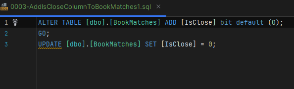
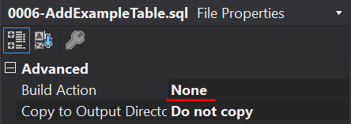

## Database migrations :card_index:

Kitbag provides a hybrid mode to handle database changes. I considered two type of approaches: 'state based' and 'migrations'. 

## State based vs Migrations
The first approach to database change management is state versioning. We hold a whole database definition in our source control repository, and when we need to change something, we change objects definitions. When the upgrade time comes, our tool compares our actual definitions with a target database and generates a migration script for us (and he can execute it right away).

Another approach is to versioning transitions instead of a state. In this approach, we create a sequence of migration scripts which lead us to the desired database state.

Both approaches have their pros and cons. To exploit the full potential of those two approaches and mitigate the presented cons, this project uses both state and transition versioning. The first one is implemented by Sql database project and the second one by the DbUp project.

**Use of database project gives us:**
- Compile-time checks - whenever there's some schema mismatch the project will not build and compiler will notify us.
- History of the definition of all objects - since we keep objects schemas in database project up-to-date, we have a full history of changes made to them,
- Quick access to schema definition - all of the objects should be easily searchable in database project,
- Ease of resolving conflicts - making changes to objects schema files allows us to quickly find conflicts. For example, when two developers tries to add the same column to the same table, they will get a conflict, because they make a change in the same file. This would not be possible with using migrations only,
- IDE support - when the objects schema script files has build action set to Build, then we get intellisense for example

_**Warning:**_ It is important to set build action of scripts to Build in Database project and None in DbUp project (migrations).

**Use of DbUp project gives us:**
- Full control of defining transitions - the migrations are written manually which allows us to prepare the most effective transition
- Pre and post-deployment scripts execution - DbUp gives us possibility to run scripts before and after migrations are processed. This might be useful for handling reference data,
- Deployment automation - with DbUp project it's really easy to automate the migrations process.
- The possibility of manual deployment - with DbUp project it's easy to deploy changes manually. Developer just has to make changes in appsettings.json and run the project.
- History of applied transitions - DbUp migrations allows us to review the process of extending database to current state.

The benefit of both of these projects is an ease of development.

## How to run migrations

Run the following command to build and run migrations (previously you need to provide connection string in _db_appsettings.json_ file):

`dotnet build ../<project abbreviation>.PortsAndAdapters.DatabaseMigration path`

`dotnet run -- project ../<project abbreviation>.PortsAndAdapters.DatabaseMigration`

## How to use:
**Tables:**

Creating new table or making changes in the existing ones requires following steps:
- Add/Modify 'CREATE TABLE' script in the Database project. This will cause that our database schema is up-to-date. Also, without this step it may not be possible to modify stored procedures or views, because the project will not compile if there are some differences.
- Add migration that contains sql script to create/alter table. This is the step required to make actual change in database. DbUp project will not generate and run a script automatically based on structure in Database project.

**Views:**
- Handling views is pretty straightforward. The only thing that needs to be done is to add/adjust the sql script.
- Scripts for views are stored in the Database project under apropriate directory.
- Views does not need any migrations. DbUp project implements changes automatically by removing and recreating the view. However if view is not needed anymore, then you will have to create a migration to drop it.
- If the view uses newly added columns to tables it is important to update table script in Database project, because otherway it may not compile.

### Examples

#### Adding new table

Lets try to add new table named Example to the database.
* Prepare a CREATE TABLE sql script and add it to the Tables directory in DatabaseProject

It is important to set the build action for this file to Build.

* As mentioned above, adding tables requires adding a new migration as well. To do that we need to create a new script file with sql to create a new table (the same as in the previous step). This file needs to be added to the Scripts/Migrations directory.

In this case, the build action should be set to None.

* When we run DbUp project now the table should be added to the databse.

### POST/PRE deployment scripts
Very often we have to update not only the database schema, but always data itself. Sometimes we just need to add a default value for all the existing records to newly added column, some other time we just have to adjust dictionary data. There are two ways to achieve that using presented approach:

- Add a migration to INSERT/UPDATE/DELETE data - this should be used when the data is manageable and can be changed using the app.
- Add post deployment script - this should be used for data that should not be modified by the app, the script will run whenever the DbUp project runs.