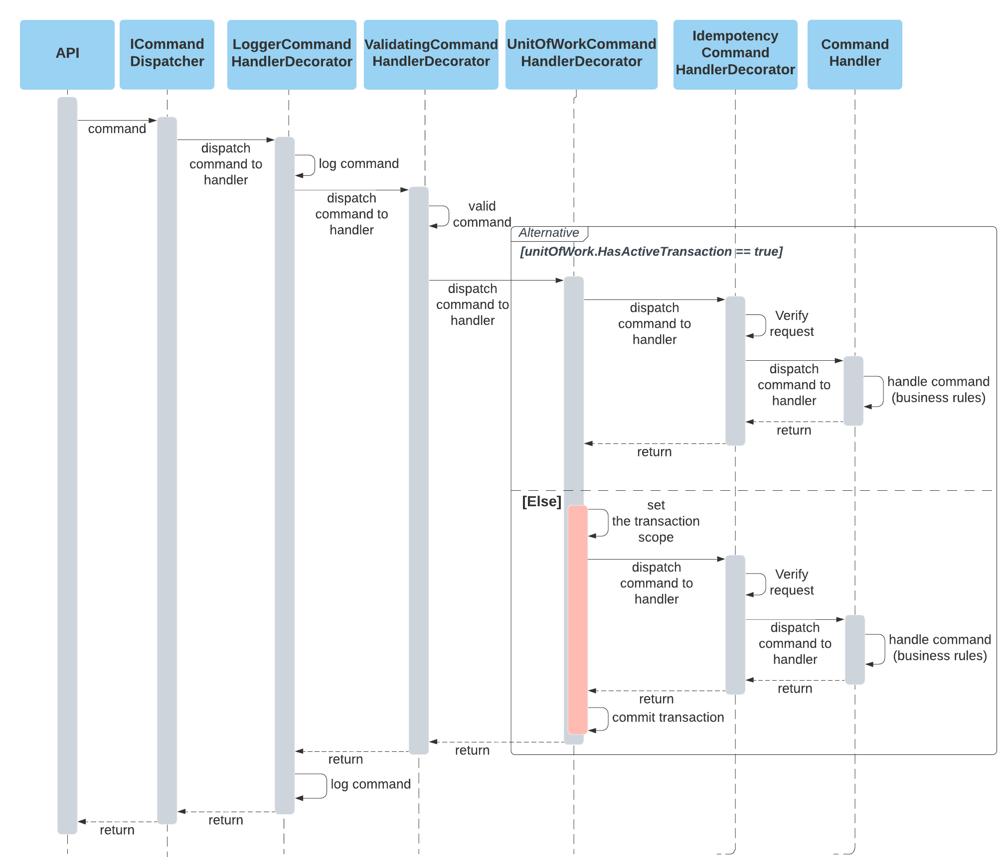

## What can you find here? :rocket:
The goal of this project is implement a reusable .NET project template with a full set of functionality. You can treat it as a reference project to avoid doing repetitive work or for training purposes. Template is based on ports and adapters pattern.

## Table of Contents
1. [Introduction](#Introduction)
2. [Quick start](#Quick-start)
3. [Decorator Strategy](#Decorator-Strategy)
4. [List of Kitbags](#List-of-Kitbags)
 
## Introduction:
The solution is divided into five parts:

- **API** contains common set of packages with startup class that runs web service instance.

- **Application** defines public contract for external applications. This is a gateway to an application core.

- **Core** provides the business logic that is written in a plain language. It delivers domain specific logic and encapsulates the logic.

- **Infrastructure** delivers the integration part like database, queue and other external providers.

- **Kitbag** provides plugins as a shared library.

## Quick start:

1. Clone the repository and run the following commands:
     1. Install the new template: *dotnet new --install {REPO PATH}*
     1. Create new solution: *dotnet new TLJ.PortsAndAdapters -n {YOUR PROJECT NAME} -o {YOUR PROJECT NAME}*
  1. Database configuration:
     1. Provide database connection string in *appsettings.json* file in *{YOUR PROJECT NAME}.API* project
     1. Provide the same database connection string in *{YOUR PROJECT NAME}.DatabaseMigration* project
     1. Run *{YOUR PROJECT NAME}.DatabaseMigration*. Project applies necessary migrations to your database.
  1. Run *{YOUR PROJECT NAME}.Api* project.
  1. Open swagger page: *http://localhost:{YOUR PORT}/index.html*

## Decorator Strategy
Every command handler is decorated with the following decorators:
1. Logger Command Handler Decorator
2. Validating Command Handler Decorator
3. Unit Of Work Command Handler Decorator
4. Idempotency Command Handler Decorator
5. Command Handler

### Key adventages: 
- The boundaries of transaction is set
- Transaction management is delegated to separate class (unit of work and decorator), thus it supports Single Responsibility Principle
- Easy way to apply more decorators to handle cross-cutting patterns

### Consequences

All developers should follow the rules and create commands and appropriate command handlers and be aware of the transaction scope and chain of command processing.

## List of Kitbags:

- **Audit Trail** :bookmark_tabs: Kitbag provides audit trail mechanism that can track any database changes without making any unnecessary modification in existing code [README](https://github.com/adrtarnowski/PortsAndAdapters/tree/main/Kitbags/Kitbag.Builder.Persistence.EntityFramework.Audit)

- **Logging** : Integration with AppInsights is added

- **Database Migrations** : Integration with UpDb is added

- **CQRS** : Integration with Dapper is added

- **Unit Of Work** : Unit of Work with AuditLog is added

- **Message Bus** : Integration with Azure Service Bus is added

- **Idempotency** : TBD

- **Outbox** : TBD

