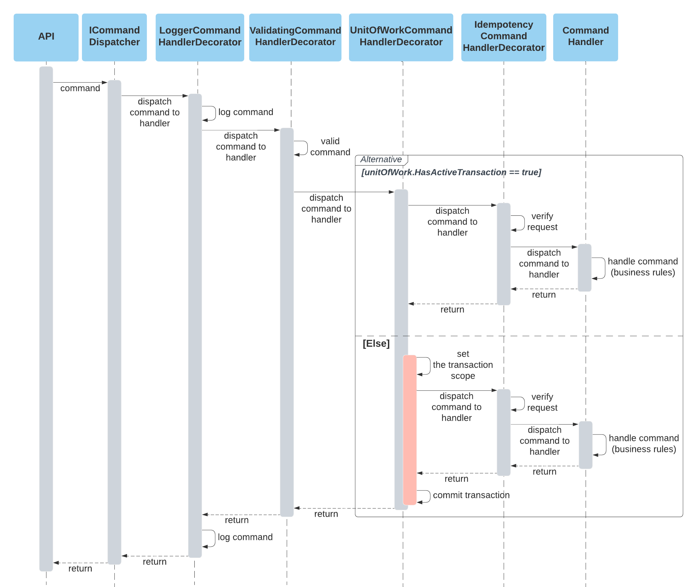

## :currency_exchange: Decorator Strategy
Every command handler is decorated with the following decorators:
1. Logger Command Handler Decorator
2. Validating Command Handler Decorator
3. Unit Of Work Command Handler Decorator
4. Idempotency Command Handler Decorator
5. Command Handler

### Key adventages:
- The boundaries of transaction is set
- Transaction management is delegated to separate class (unit of work and decorator), thus it supports Single Responsibility Principle
- Easy way to apply more decorators to handle cross-cutting patterns

### Consequences

All developers should follow the rules and create commands and appropriate command handlers and be aware of the transaction scope and chain of command processing.
